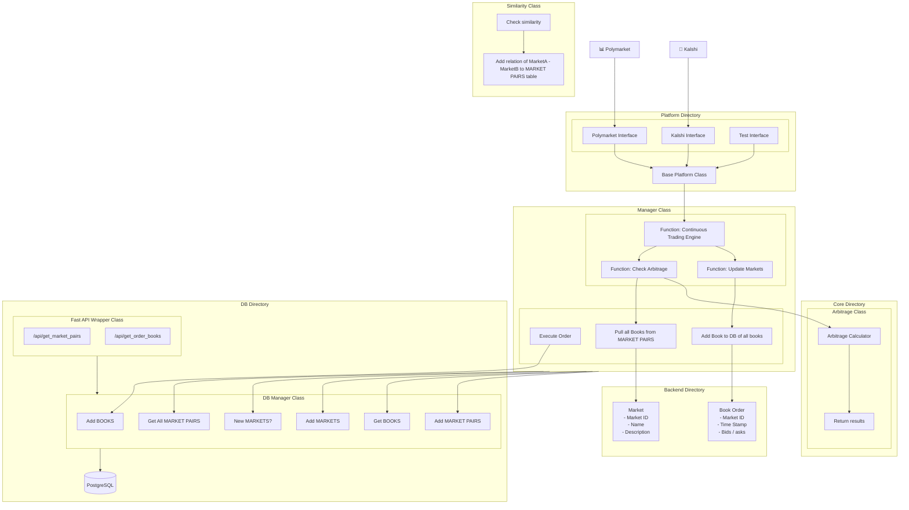

## **Events Contract Trading** [](https://harris-song.github.io/events-contract-trading)  


**Kalshi / Polymarket Statistical Arbitrage Monitoring and Trade Execution**
<table border="0" cellspacing="0" cellpadding="0" style="width: 100%";>
  <tr>
    <!-- LEFT COLUMN: Introduction -->
    <td valign="top" width="60%" cellpading="0">
      <h2>Introduction</h2>
      <p>
        A robust, full-stack interface for real-time ingestion and processing of Polymarket and Kalshi data, designed to support continuous statistical arbitrage analysis across event-based markets. The system leverages 
        <a href="https://platform.openai.com/docs/guides/structured-outputs?api-mode=chat">OpenAI Structured Outputs</a> 
        through the API to automatically detect and surface new cross-platform arbitrage opportunities through structured market comparisons.
      </p>
      <p>
      </p>
    </td>
    <td valign="center" align="center" width="40%">
      <table>
        <tr>
          <td colspan="3" align="center" style="padding-bottom: 10px;">
            <a href="https://github.com/hmac213/event-contract-trading/stargazers">
              
            </a>
          </td>
        </tr>
        <tr>
          <td colspan="3" align="center" style="padding-bottom: 20px;">
            🔗 <a href="https://harris-song.github.io/events-contract-trading"><strong>Live Project Site</strong></a>
          </td>
        </tr>
        <tr>
          <td align="center" valign="top">
            <b>Harris Song</b><br>
            <a href="https://www.linkedin.com/in/harris-song/">
              
            </a><br>
            <a href="https://harris-song.github.io">
              
            </a>
          </td>
          <td align="center" valign="top">
            <b>Henry</b><br>
            <a href="https://www.linkedin.com/in/hmac213/">
              
            </a>
          </td>
        </tr>
      </table>
    </td>
  </tr>
</table>
        Backed by a PostgreSQL database and integrated with a high-performance Python-based FAST API, the backend adheres to RESTful API design principles, enabling reliable access to historical and live market data. A live project site provides real-time visualization and interaction with the arbitrage engine, while the API framework supports extensible endpoint creation for research, trading, and analytics applications.

### Setup

To get started with the project, clone the repository and install all necessary dependencies. Then, run the backend service using the command-line interface provided by the Manager module. This will initialize the API and connect to the configured PostgreSQL database, enabling real-time access to market data and arbitrage calculations.

```bash
git clone https://github.com/harris-song/events-contract-trading
cd events-contract-trading
pip install -r requirements.txt
python -m backend.core.Manager
```

### Cross-Platform Arbitrage Module

This algorithm detects and quantifies arbitrage between two equivalent event-contract markets on separate platforms. Here's how it works:

1. An LLM-based matcher identifies pairs of identical contracts (e.g. “Outcome X” on Platform A ↔ “Outcome X” on Platform B) and loads each platform’s live orderbook.

2. Raw price–quantity levels are aggregated into monotonic cumulative curves, enabling rapid computation of the total cost to acquire any given quantity.

3. A binary search over possible trade sizes finds the largest quantity for which expected proceeds (gross payout minus slippage buffer) meet or exceed the configured profit margin.

4. If a hard spending limit is specified, a second binary search determines the maximum affordable quantity under that cap. The final trade size is the minimum of the profit-optimal and cost-constrained values.

5. The function then returns an available arbitrage opportunity (if one exists), which we then execute on our trading engine.

#### The Math Behind the Algorithm

This algorithm boils down to a mathematical optimization problem. That being said, we walk through the math which motivates our solution to finding arbitrage. Let $X$ be a candidate trade size, measured by the number of shares bought on each platform. In addition, we represent the orderbooks by $`\{(p_i, q_i)\}_{i \in \mathbb{N}}`$ and $`\{(p_i\prime, q_i\prime)\}_{i \in \mathbb{N}}`$ for the 'yes' and 'no' sides with $p$ tracking price and $q$ quantity. We represent the cumulative cost to buy $X$ shares on both platforms as $C(X)$. From here, we arrive at the driving formula:

$$
C(X) = \sum_{i} p_i \min\left(q_i, X - \sum_{j = 1}^{i - 1}q_j\right) + \sum_{i} p_i\prime \min\left(q_i\prime, X - \sum_{j = 1}^{i - 1}q_j\prime\right)
$$

After accounting for a cost, we desire some profit $\theta$ and account for market conditions by factoring in an expected slippage constant $\epsilon$. We then arrive at a final share quantity $X^{*}$ determined by

$$
X^{*} = \arg\max\left(C(X)(1 + \theta)(1 + \epsilon) \leq X\right).
$$

### System Diagram
Each component is modular, with clearly defined responsibilities across the `Backend`, `Core`, `Platform`, and `DB` directories. The `Manager` class coordinates the continuous trading engine and database updates.



