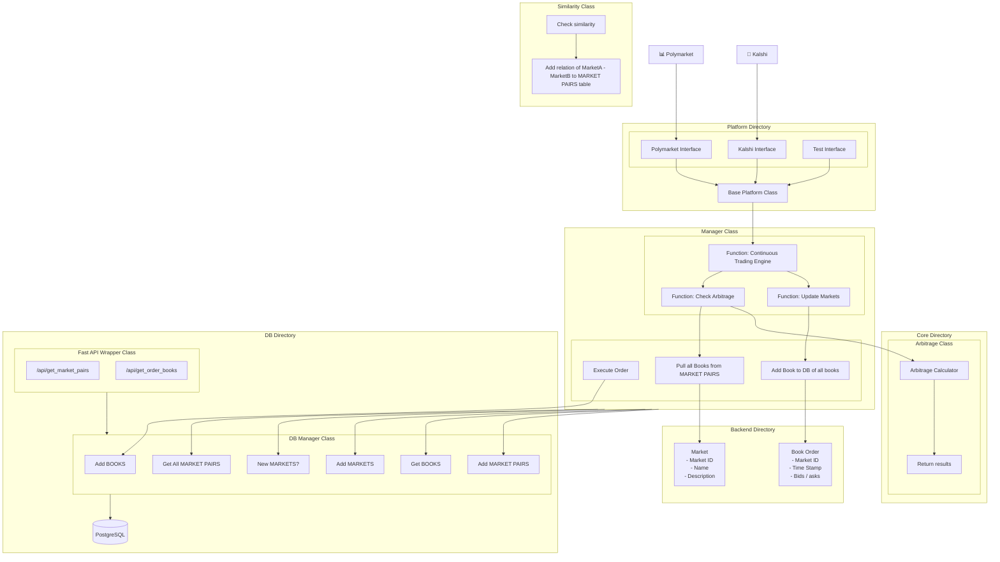

## **Events Contract Trading**

**Kalshi / Polymarket Statistical Arbitrage Monitoring and Trade Execution**

Check it out:  
[Live Project Site](https://harris-song.github.io/events-contract-trading)
[](https://www.linkedin.com/in/harris-song/)
[](https://www.linkedin.com/in/hmac213/)

---

### Introduction


A robust, full-stack interface for real-time ingestion and processing of Polymarket and Kalshi data, designed to support continuous statistical arbitrage analysis across event-based markets. The system leverages [OpenAI Structured Outputs](https://platform.openai.com/docs/guides/structured-outputs?api-mode=chat) through the API to automatically detect and surface new cross-platform arbitrage opportunities through structured market comparisons. 

Backed by a PostgreSQL database and integrated with a high-performance Python-based FAST API, the backend adheres to RESTful API design principles, enabling reliable access to historical and live market data. A live project site provides real-time visualization and interaction with the arbitrage engine, while the API framework supports extensible endpoint creation for research, trading, and analytics applications.

### Setup

To get started with the project, clone the repository and install all necessary dependencies. Then, run the backend service using the command-line interface provided by the Manager module. This will initialize the API and connect to the configured PostgreSQL database, enabling real-time access to market data and arbitrage calculations.

```bash
git clone https://github.com/harris-song/events-contract-trading
cd events-contract-trading
pip install -r requirements.txt
python -m backend.core.Manager
```


### System Diagram
Each component is modular, with clearly defined responsibilities across the `Backend`, `Core`, `Platform`, and `DB` directories. The `Manager` class coordinates the continuous trading engine and database updates.



