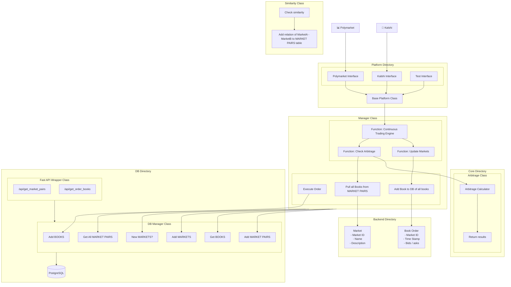

## **Events Contract Trading**

**Kalshi / Polymarket Statistical Arbitrage Monitoring and Trade Execution**

Check it out:  
[Live Project Site](https://harris-song.github.io/events-contract-trading)

---

### Introduction

Interface for pulling Polymarket and Kalshi data, continuous updates fro

### Setup

```bash
git clone https://github.com/harris-song/events-contract-trading
cd events-contract-trading
pip install -r requirements.txt
python -m backend.core.Manager
```


